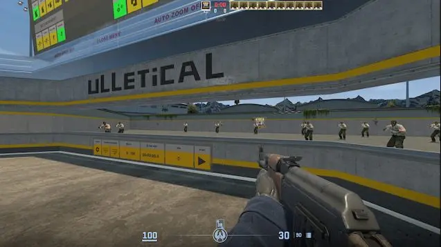

1. Map layout is soo bad and my player spawn in center adn gets destroyed by bots immediately. the bots map should be like arena map in cs go or valorant. the bots don't shoot at all. 
1.1 
2. The assets and models are so bad. increase the quality of the models and assets. Also improve the map layout its suppose to be a 5 v 5 or n v n game. with spike plant and defuse. 
2.2 Increase polygon count of the models and assets. 
2.3 The guns are not loaded at all. can differientiate between different guns. 
2.4 As soon as you switch to knife the game crashse.
2.5 The game is not optimized at all. it lags a lot. 
3. there is not radar or mini map.
3.1 bullet hits are same for headshot and body shot and if you shoot random objects so there is no bullet hit effect. and they dont hae trail Make them look good.
4. A lot of thhings are implmented but there is no way to experice them. make tutorial for all the features. this could be used to test them as well.
5. Can't test multiplayer features at all. 
6. the overall UI is soo bad. make it look good. make it look like a pro game. 
6.1 its not user friendly at all. 
7. Its too difficult to test features for me. we have to implement a system to test features. for that you can do it without running the game. IMplment industry standard integratin or unit test for all features. target 80 percent coverage. dont slop just for passing the tests